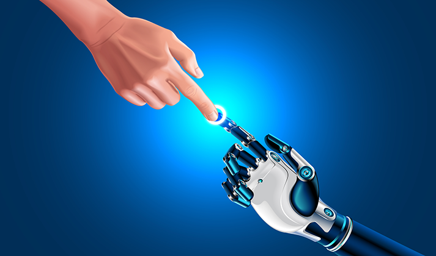

# Introduction
---------

<iframe src="https://giphy.com/embed/H7rpSYHRyYgamxQNqw" width="800" height="400" frameBorder="0" class="giphy-embed" allowFullScreen></iframe>

Inspired by human imagination and ingenuity, autonomous vehicles encompass an entire class of technologically driven, self-driving transportation mediums. This class includes self-driving cars, public transportation, like buses and taxis, and long-distance transport vehicles, like semi-trucks. This technology, seemingly pulled straight from an episode of The Jetsons, is no longer just science-fiction. Autonomous vehicles is a technology fervently under research, with promising case studies and technologies; some companies, for example Tesla, have even incorporated self-driving technology in vehicles on the market today, including the hardware necessary for when full self-driving is approved for mass consumers [1]. As of now, certain facets of self-driving technology is piloted in high-end vehicles in the form of "driver-assistance", which helps in lane detection, parking assistance, collision avoidance, and other detection systems that assist the driver. But it seems that fully autonomous vehicles will be here in no time!

While autonomous vehicles definitely inspire the "wow"-factor, there are implications that need to be considered before autonomous vehicles can be indoctrinated into our everyday lives. We will explore a variety of different ethical dimensions that autonomous vehicles introduce. These are dimensions that need to be considered in order for all of us to benefit from autonomous vehicle technology. It's important to highlight that many of these ethical dimensions overlap with each other, as many implications are necessarily multi-dimensional.

# Social Implications
-----------

We begin by discussing the social implications that autonomous vehicles can have on society. Specifically, we focus on the human-computer/human-technology interaction that arises from the use of autonomous vehicles; we also highlight the human psychological and emotional experience with autonomous vehicles, in terms of fear and trust. We will separate this portion between two topics: autonomous personal vehicles and autonomous public transportation.

### A sidenote on human trust and technology

Trust is the cornerstone of human society. Trust builds relationships, forms bonds, and allows us to work with individuals to accomplish challenging tasks. Introduce a non-human element that a human interacts with and a new meaning of trust has to be introduced. The human-technology trust relationship is varied, depending on the human user. For example, younger generation individuals, often deemed "digital natives" have grown up, or are currently growing up, in a technologically driven society - a world of laptops, smartphones, and upcoming self-driving cars; trust in technology seems inherent to the digital natives as they have been brought up in this environment. On the other hand, older generations of individuals, in general, are less receptive to technological advances because of a variety of different reasons, but primarily because of a lack of understanding; this lack of understanding engenders a distrustful attitude towards new technologies [2]. Thus, the conversation about human trust in technology is foundational to understanding the social implications of autonomous vehicles. In fact, trust is a "primary predictor of technology usage and a fundamental construct for understanding user perceptions of technology [3]".

### Autonomous Personally-owned Vehicles

A big component of choosing a personally owned vehicle is the safety ratings. If autonomous vehicles become a new standard in the automotive industry, then the perception of trust in the technology driving the autonomous vehicle becomes paramount. As discussed above, trust is a deep psychological, foundational factor that humans must be able to build with technology in order to be willing to use it. Of course, not many people would want to get into a vehicle that is not safe, as humans are naturally self-preserving creatures. Therefore, the question rises: how much do humans trust self-driving technology when it comes to vehicles?

According to research, humans (even older humans) already trust self-driving technology quite a bit. Once humans experience self-driving themselves, trust actually increases even more [4]. A study with Tesla Autopilot, a self-driving technology, was conducted among participants to measure trust in self-driving technology. The results show that initial trust in the technology was surprisingly quite high and increased even more as people experienced the technology themselves [4]. The study also highlights that trust in this technology is also influenced by age, which reaches back to the brief discussion about "digital natives" and older generations.

Although trust was generally high among most individuals, there is still a lingering fear among users of self-driving cars, especially concerning the technology's safety and reliability in high-speed environments (like highways) or long-distance travel [4]. 

 Figure 1: Trust Results from Tesla Autopilot Study. 95% Confidence Intervals [4]. 

Studies like these may be crucial to engendering trust in self-driving personal cars. Communities that seek to adopt legislation in allowing self-driving autonomous vehicles might want to pursue information campaigns to educate people on the safety of autonomous vehicle technology, after more extensive research is conducted. Communities will only be able to integrate self-driving vehicles once fear is dispelled and trust is built in the technology.

### Autonomous Public Transportation

In discussing autonomous public transportation, we look primarily at public buses. Using autonomous public buses is two-fold as well, in terms of social trust. There is social trust in the driving technology of the autonomous bus and there is a social trust that must exist among people that are actually using the bus. 

Trust in the self-driving technology is a similar discussion to engendering trust within autonomous personal vehicles. However, extra precaution should be taken when adopting self-driving technology in public buses. It's important to weigh the considerations of individuals who use the bus for daily transportation. If autonomous driving is implemented in buses without the consideration of the people that use the buses, a population might feel excluded from using the buses because of a lack of trust in the technology. An information campaign about the safety of autonomous vehicle technology should not be assumed to be accessible by communities that public buses typically serve (typically, lower-income, disadvantaged individuals and communities). A more deliberate campaign of information about self-driving buses would have to be incorporated so that disadvantaged and under-represented communities can become informed and voice concerns about the implementation of this technology, as they would be the primary stakeholders of this usage of the self-driving technology. 

In addition to the public trust in the technology driving the autonomous buses, we must also consider the social implications of human-human interactions on the public buses. In particular, we should discuss potential crime and violence among individuals utilizing a public bus. Before the implementation of autonomous buses, does the presence of an authoritative figure on the bus (i.e. a bus driver) deter or prevent crime? If the self-driving nature of a bus eliminates the need for a bus driver, how will human-human conflicts be managed and negotiated on buses; does this present another element of fear that could deter users from using the bus? A potential solution could be to have a bus driver on the bus to 1) ensure the technology is in proper working order, potentially stepping in, in case the self-driving technology fails, and 2) to prevent and deter crime on the bus, hopefully distilling fear of illegal or violent activities on buses. The input of communities who utilize public buses will again need to be weighed considerably, as to not affect the experience or accessibility of using public buses for transportation.

### Wrapping up the Social Dimension

The elements of human emotion and experience is cornerstone to the implementation of autonomous vehicles in everyday life. It's imperative to understand the consequentialist perspective in this ethical dimension. The adoption of self-driving cars and self-driving public transportation can have positive and negative impacts, especially in regards to engendering trust (in the case of developing awareness for the technology) or potentially engendering fear (such as in public buses because of lack of some authoritarian or lawful figure). The social and human experience are some of the most important set of implications to consider on the discussion of autonomous vehicles.

# Economic Implications
----------

### Infrastructure

The next ethical dimension we need to explore is the economic implications that autonomous vehicles will have on society. According to research conducted by the American Society of Civil Engineers (ASCE), US infrastructure could not support nor maintain autonomous vehicle usage on its roads and bridges, due to a lack of infrastructure investments and upgrades. As of 2017, the ASCE estimated that the United States would require $4.59 trillion in order to improve failing or deficient infrastructure [5]. Only once these deficits are corrected could US infrastructure support mass autonomous vehicle implementation across the country.

Even implemented at the community level, communities would need to invest a significant amount of money to improve their infrastructure to the level required to support autonomous vehicles. Like the federal government, many communities result to tax increases, tolls, or other fees in order to raise the money they need for this infrastructure investment [6]. However, increasing taxes to support improving infrastructure will increase the financial burden on economically disadvantaged communities and individuals. Improving infrastructure would need to be approached from an equitable position, as only improving the infrastructure to allow the usage of autonomous vehicles would only benefit those who have access to autonomous vehicles, in which a majority of disadvantaged communities do not have access. Consequently, taxes increased for communities who don't necessarily stand to benefit from specific infrastructure improvements leads to unwarranted financial burden. Instead, it's imperative that, if a community decides to invest in infrastructure for autonomous vehicles, it invests in infrastructure in an equitable way - invest in infrastructure in disadvantaged communities (whose communities are typically suffering from a lack of infrastructure investment) first, while also improving infrastructure for autonomous vehicle usage within the community. This will serve the population that has the means to utilize personally owned autonomous vehicles, but will also pave the way to have autonomous buses and public transportation serve under-privileged communities, when infrastructure improvements in their communities is complete. If infrastructure investment is not allocated in an equitable way, it will only lead to increased social and economic stratification between privileged and under-privileged communities.

### Public Transportation Costs

With the advent of self-driving technology, public transportation will likely be a sector recipient of government funded self-driving technology, to increase the efficiency of public transportation within a community [7]. However, taking a consequentialist perspective, this may not be a good way forward. Self-driving technology in public transportation will defer technology upgrade costs to users of public transportation [7, 8]. In the case of autonomous public buses, bus fares would most likely increase by a significant amount to offset the technology upgrade. This creates an economic barrier for primary users of public buses because more often than not, these primary users are already economically disadvantaged. Deontologically speaking, this increase in price (however modest it is) hurts financially unstable individuals. A way forward would be to have some sort of federal subsidy that helps cover the gap in public bus transportation price, to maintain the current price so that it does not affect those who rely on the bus as their main mode of transportation.

### Potential Job Loss

Another key economic implication of autonomous vehicles is job loss - in particular, this could affect truck drivers, bus drivers, taxi drivers, and other jobs that rely on transportation (maybe not quite airplanes). In particular, this greatly affects the trucking industry. As autonomous vehicles become more prevalent, mass numbers of truckers will no longer be needed, resulting in millions of lost jobs for truckers [8]. The truckers that do remain will primarily be kept around for truck maintenance, truck logging, and other administrative needs dealing with transportation of goods [9]. This massive job loss is a very serious negative consequence that can affect a lot of people, if not handled correctly (pretty much a consequentialist's and deontologist's nightmare). A potential solution to this could be for trucking companies to subsidize education programs for truckers to gain new skills that can be applied to other industries.

### Wrapping up Economic Implications

Automation increases efficiency and productivity, in the public and private spheres, but at a great cost. Most economic consequences pose great ethical challenges that need to be overcome in order for automation to be ready to be accepted by the general population.

# Safety Implications
---------
<iframe src="https://giphy.com/embed/lo5HLcAPFSgTZNTpAn" width="850" height="400" frameBorder="0" class="giphy-embed" allowFullScreen></iframe>

The final ethical dimension we look at is the safety implications that autonomous vehicles have on society. This ethical dimension is multi-faceted and includes driving safety, and cyber security and data collection concerns.

### Driving Safety

To begin the discussion on driving safety, it's important to note that there isn't a lot of empirical research on the impact that autonomous vehicles have on driving safety, as autonomous vehicles are still a lab/research concept. However, the use of some autonomous driving tools like lane detection, collision avoidance, driver alertness detection, parking assistance, pedestrian detection, and others, have proven to be effective in mitigating potential accidents (or at least giving the driver a heads up so they can react, helping to prevent an accident from being in the worst case) [10]. Since the use of driver assistance technology has been proven to be effective in maintaining driver awareness and mitigating vehicular accidents, common industry opinion and research argue that fully autonomous vehicles can remove the human factor from driving. In doing so, the potential for human error in driving is removed, saving lives and creating safer driving conditions. 

The implementation of fully autonomous vehicles would, of course, be a phased implementation [11]. First, as more research and study is completed on practical usage of fully autonomous vehicles, humans will still be responsible for maintaining control of the vehicle, in case of autonomous vehicle technology malfunction. But, after more study and technological improvements, humans will no longer be required, or responsible, for maintaining positive control of the vehicle, leaving humans to fully benefit from the safety and convenience of autonomous technology.

### Cyber Security and Data Collection

In terms of cyber security and data collection, there are a lot of concerns when it comes to autonomous vehicles. In terms of hardware and software security for the autonomous vehicle, researchers have identified particularly worrisome vulnerabilities, such as hacking the wireless Event Data Recorder system, jamming the GPS signal for the purposes of theft, modifying sensors and maps to distort perceptions that the autonomous vehicle bases decisions upon, and conducting Denial of Service (DoS) attacks to prevent receiving critical information, like software patch updates [12]. The only viable prevention strategy against cyber attacks on autonomous vehicles is to have 24/7 critical cyber response teams to consistently evaluate autonomous vehicle networks, GPS systems, and conduct continuous software patches. However, ensuring that software is always up to date and protecting autonomous vehicle networks is not enough. Given enough resources, malicious actors (potentially adversarial nation-state actors, or equivalents) are still able to develop malicious exploits, like zero-days that could cause catastrophic consequences.

In addition to the potential software/hardware vulnerabilities that autonomous vehicles face, we must also consider data privacy of autonomous vehicle consumers. By nature of the autonomous vehicle's design, it could store a user's location data, financial information (like credit cards), etc. If stolen because of software or hardware vulnerabilities, this information could potentially be abused by targeted advertising, identity theft, financial fraud, tracking of individuals, etc [12]. There would be an inherent need for extensive legislation to protect consumer data, holding autonomous vehicle manufacturers and network providers responsible for securing and protecting the data that the autonomous vehicles hold.

### Wrapping up Safety Implications

In general, I believe ethical theories would be pretty split on general autonomous vehicle implementation. On one hand, consequentialism would say that autonomous vehicles are a safer alternative to human-driven vehicles because of the reducion in human error and potential reduction in vehicle accidents. On the other hand, the potential cybersecurity threat and threat to personal information harms the general class of consumers by infringing on their right to safety and security. It certainly wouldn't be socially or ethically responsible to allow mass use of autonomous vehicles without clear cybersecurity and data privacy regulations. The safety implications that arise with autonomous vehicles are among some of the most important implications to consider.

# Concluding Remarks
-------

We haave reviewed the social, economic, and safety implications that autonomous vehicles would have on society. Each set of these ethical dimensions raise important questions of liability, responsibility, safety, and equality. Autonomous vehicle technology is definitely here to stay. But, it's important to consider the short-term and long-term ethical implications and their effects on society and people.

Autonomous vehicles are new, exciting, and a true vision of the future! But, currently where we stand, there are a lot of issues to solve before the world is ready to enter into the age of The Jetsons - for now, autonomous vehicles are, and rightfully should still remain, a thing of the future.

-----

P.S. -

Go Jackets!

<iframe src="https://giphy.com/embed/U4k5p9obbDgmRug8aH" width="480" height="270" frameBorder="0" class="giphy-embed" allowFullScreen></iframe>
<a href="https://giphy.com/gifs/buzz-gt-georgia-tech-U4k5p9obbDgmRug8aH">via GIPHY</a>

# References
----------
[1] "Future of Driving", _Tesla_. Available: https://www.tesla.com/autopilot/. [accessed July 14, 2020].

[2] E. Mordini, "Technology and fear: is wonder the key?", _Trends in Biotechnology_, vol.25, no. 12, pp. 544-546, 2007. [Online Serial]. Available: https://www.sciencedirect.com/science/article/abs/pii/S0167779907002661. [accessed July 14, 2020].

[3] X. Li, T. Hess, and J. Valacich, "Why do we trust new technology? A study of initial trust formation with organizational information systems", _The Journal of Strategic Information Systems_, vol. 17, no. 1, pp. 39-71, 2008. [Online Serial]. Available: https://www.sciencedirect.com/science/article/abs/pii/S0963868708000036. [accessed July 14, 2020].

[4] M. Dikmen, C. Burns, "Trust in autonomous vehicles: The case of Tesla Autopilot and Summon", _2017 IEEE International Conference on Systems, Man, and Cybernetics (SMC)_, pp. 1093-1098, 2017. Available: https://ieeexplore.ieee.org/abstract/document/8122757. [accessed July 14, 2020].

[5] "2017 Infrastructure Report Card", _American Society of Civil Engineers_, 2017. Available: https://www.infrastructurereportcard.org/making-the-grade/report-card-history/. [accessed July 14, 2020]

[6] I. Cohen, T. Freiling, E. Robinson, "The Economic Impact and Financing of Infrastructure Spending", _College of William & Mary, Thomas Jefferson Program in Public Policy_. Available: https://trid.trb.org/view/1138658. [accessed July 14, 2020].

[7] P. Bosch, F. Becker, H. Becker, K. Axhausen, "Cost-based analysis of autonomous mobility services", _Transport Policy_, vol. 64, pp. 76-91, 2018. [Online Serial]. Available: https://www.sciencedirect.com/science/article/pii/S0967070X17300811. [accessed July 14, 2020].

[8] D. Fagnanta, K. Kockelman,"Preparing a nation for autonomous vehicles: opportunities, barriers and policy recommendations", _Transportation Research Part A: Policy and Practice_, vol. 77, pp. 167-181, 2015. [Online Serial]. Available: https://www.sciencedirect.com/science/article/abs/pii/S0965856415000804. [accessed July 14, 2020].

[9] P. Slowik, B. Sharpe, "Automation in the long haul: Challenges and opportunities of autonomous heavy-duty trucking in the United States", _The International Council on Clean Transportation_, 2018. Available: https://theicct.org/sites/default/files/publications/Automation_long-haul_WorkingPaper-06_20180328.pdf. [accessed July 14, 2020].

[10] K. Bengler, K. Dietmayer, B. Farber, M. Maurer, C. Stiller, H. Winner, "Three Decades of Driver Assistance Systems: Review and Future Perspectives", _IEEE Xplore_, 2014. Available: https://ieeexplore.ieee.org/abstract/document/6936444. [accessed July 15, 2020].

[11] R. Remenyte-Prescott, J.D. Andrews, P.W.H. Chung, "An efficient phased mission reliability analysis for autonomous vehicles", _Reliability Engineering & System Safety_, vol. 95, no.3, pp. 226-235, 2010. [Online Serial]. Available: https://www.sciencedirect.com/science/article/abs/pii/S0951832009002397. [accessed July 15, 2020].

[12] H. Lim, A. Taeihagh, "Autonomous Vehicles for Smart and Sustainable Cities: An In-Depth Exploration of Privacy and Cybersecurity Implications", _Energies_, vol. 11, no. 5, 2018. Available: https://www.mdpi.com/1996-1073/11/5/1062. [accessed July 15, 2020].
